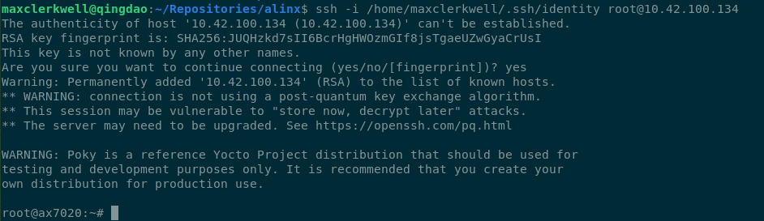

# Vom U-Boot-Prompt zum netzwerkfähigen Linux — ein Walkthrough

Diese Datei protokolliert eine durchgehende Arbeitssitzung am **Alinx AX7020**
(Zynq-7000, XC7Z020). Ausgangspunkt war ein Board, das bereits mainline U-Boot
aus dem QSPI-Flash startete; am Ende läuft ein Linux, das eigenständig bootet,
im Firmennetz unter seinem Namen auffindbar ist, nur per SSH-Schlüssel
zugänglich — und das sich künftig frische Yocto-Images selbst aus dem Netz holen
kann.

Der Text ist bewusst als **nachvollziehbarer Walkthrough** geschrieben: jeder
Schritt mit den tatsächlich abgesetzten Kommandos, und vor allem mit den
Sackgassen. Drei der wertvollsten Erkenntnisse stammen aus Fehlern, die erst am
echten Gerät sichtbar wurden.

**Inhalt**

1. [Ausgangslage](#1-ausgangslage)
2. [Yocto aufsetzen — der nächtliche Build](#2-yocto-aufsetzen--der-nächtliche-build)
3. [Erster Linux-Start aus dem RAM](#3-erster-linux-start-aus-dem-ram)
4. [Zwischenspiel: eine REST-API für die Netzwerk-Clients](#4-zwischenspiel-eine-rest-api-für-die-netzwerk-clients)
5. [U-Boot bekommt eine feste Identität](#5-u-boot-bekommt-eine-feste-identität)
6. [Konsolen-Reservierung: wer zuerst tippt, bekommt das Board](#6-konsolen-reservierung-wer-zuerst-tippt-bekommt-das-board)
7. [Das Board am Firmennetz — und warum U-Boot dort verstummt](#7-das-board-am-firmennetz--und-warum-u-boot-dort-verstummt)
8. [Architekturwechsel: ein Wartungssystem im Flash](#8-architekturwechsel-ein-wartungssystem-im-flash)
9. [Das BAR-Desaster](#9-das-bar-desaster)
10. [Flashen ohne JTAG](#10-flashen-ohne-jtag)
11. [SSH nur mit Schlüssel](#11-ssh-nur-mit-schlüssel)
12. [Merksätze](#12-merksätze)

---

## 1. Ausgangslage

Im QSPI lagen `boot.bin` (U-Boot SPL mit Xilinx-Header) und `u-boot.img`.
Bedient wurde das Board über **U-Boots Netconsole** — es hängt kein serielles
Kabel dran, die gesamte Kommunikation läuft über UDP-Port 6666.

Werkzeuge aus dem Repo:

```bash
# JTAG-Adapter (FT232H, nur die vier MPSSE-Pins)
openocd -f openocd/ft232h.cfg -f target/zynq_7000.cfg

# U-Boot-Konsole über Netz
python3 tools/ncsh.py <board-ip> "version" "bdinfo"

# unprivilegierter TFTP-Server für Firmware-Transfers
python3 tools/tftpd.py tftp 6969
```

Ziel dieser Sitzung: **Linux**.

---

## 2. Yocto aufsetzen — der nächtliche Build

### 2.1 Release-Wahl

`scarthgap` (Yocto 5.0 LTS) — nicht aus Vorliebe, sondern aus Zwang:

```bash
git ls-remote --heads https://github.com/Xilinx/meta-xilinx | grep -E "scarthgap|styhead|walnascar"
# -> nur scarthgap
```

meta-xilinx bietet keinen neueren Release-Branch. Damit ist der gemeinsame
Nenner gesetzt; poky, meta-arm und meta-openembedded folgen.

### 2.2 Layer holen

```bash
mkdir -p yocto && cd yocto
for r in "https://git.yoctoproject.org/poky poky" \
         "https://github.com/Xilinx/meta-xilinx meta-xilinx" \
         "https://git.yoctoproject.org/meta-arm meta-arm" \
         "https://github.com/openembedded/meta-openembedded meta-openembedded"; do
    set -- $r; git clone --depth 1 -b scarthgap "$1" "$2"
done
```

Flache Klone, zusammen rund 170 MB.

### 2.3 Host-Voraussetzungen

```bash
sudo apt install diffstat chrpath lz4
```

Zwei Stolpersteine, die praktisch jede Anleitung noch falsch beschreibt:

* `liblz4-tool` gibt es in Debian 13 **nicht mehr** — das Binary steckt in `lz4`.
* Yocto verlangt das Werkzeug unter dem alten Namen **`lz4c`**, den lz4 ≥ 1.10
  nicht mehr installiert.

Statt dafür mit `sudo` einen Symlink nach `/usr/local/bin` zu legen, liegt er
im Repo und wird per `PATH` eingebunden:

```bash
ln -s /usr/bin/lz4 yocto/hostbin/lz4c
```

`yocto/setup-build.sh` hängt `hostbin` vorne an den `PATH` — kein Root nötig,
und der Fix reist mit dem Repo mit.

### 2.4 Das eigene Layer

`yocto/meta-ax7020/` enthält vier Dinge:

**Maschine** (`conf/machine/ax7020.conf`) — baut auf meta-xilinx' generischer
Zynq-Maschine auf und schränkt ein:

```
require conf/machine/zynq-generic.conf

KERNEL_DEVICETREE = "xilinx/zynq-ax7020.dtb"

KERNEL_IMAGETYPE = "fitImage"
KERNEL_CLASSES   = "kernel-fitimage"
INITRAMFS_IMAGE  = "ax7020-initramfs"
INITRAMFS_IMAGE_BUNDLE = "0"

# U-Boot kommt aus mainline, nicht aus Yocto
PREFERRED_PROVIDER_virtual/bootloader = ""
```

**Device Tree** (`recipes-kernel/linux/files/zynq-ax7020.dts`) — jeder Wert
stammt aus `design_1.hwh` des Alinx-Vivado-Projekts und dem Schaltplan, nicht
aus einer Vorlage:

```dts
&gem0 {
	status = "okay";
	phy-mode = "rgmii-id";
	phy-handle = <&ethernet_phy>;
	ethernet_phy: ethernet-phy@1 { reg = <1>; };   /* RTL8211E-VL */
};

&qspi {
	status = "okay";
	num-cs = <1>;
	flash@0 {
		compatible = "w25q256", "jedec,spi-nor";
		spi-rx-bus-width = <1>;      /* siehe Kapitel 9 */
		spi-max-frequency = <25000000>;
	};
};
```

**Kernel-Fragment** (`files/ax7020.cfg`) — schaltet ein, was gebraucht wird,
und wirft raus, was das Board nicht hat:

```
CONFIG_FPGA=y
CONFIG_FPGA_MGR_ZYNQ_FPGA=y
CONFIG_FPGA_REGION=y
CONFIG_OF_FPGA_REGION=y
CONFIG_OF_OVERLAY=y
CONFIG_DEVTMPFS_MOUNT=y
CONFIG_NETCONSOLE=y
CONFIG_MTD_SPI_NOR=y
CONFIG_SPI_ZYNQ_QSPI=y

# CONFIG_DRM is not set
# CONFIG_SOUND is not set
# CONFIG_WLAN is not set
# CONFIG_IPV6 is not set
```

`zynq-7000.dtsi` bringt `devcfg@f8007000` und einen `fpga-region`-Knoten bereits
aktiviert mit — für den FPGA-Manager war also nichts Board-spezifisches nötig.

**Image** (`recipes-core/images/ax7020-initramfs.bb`) — `core-image-minimal`
als `cpio.gz`, plus dropbear.

### 2.5 Bauen — und drei Fehler

```bash
source yocto/setup-build.sh
bitbake virtual/kernel
```

**Betriebshinweis, der eine Stunde gekostet hat:** bitbake gehört *entkoppelt*
gestartet. Wird der Client abgeräumt, nimmt er den `bitbake-server` mit —
"Exiting as we could obtain the lock" — und der Build steht still:

```bash
setsid nohup bash -c 'source yocto/setup-build.sh >/dev/null 2>&1; \
    exec bitbake virtual/kernel' > build.log 2>&1 < /dev/null &
```

Neustarts sind billig: `sstate-cache` und `tmp/work` lassen ihn an der
Abbruchstelle weitermachen.

**Fehler 1 — `${UNPACKDIR}` gibt es in scarthgap nicht.**

```
| install: cannot stat '/zynq-ax7020.dts': No such file or directory
ERROR: linux-xlnx do_configure failed
```

Die Variable kam erst mit Yocto 5.1; in scarthgap landen SRC_URI-Dateien in
`${WORKDIR}`. Der bbappend nutzt jetzt einen Fallback:

```bash
src="${UNPACKDIR}/zynq-ax7020.dts"
[ -f "$src" ] || src="${WORKDIR}/zynq-ax7020.dts"
install -m 0644 "$src" "$dtsdir/zynq-ax7020.dts"
```

**Fehler 2 — `bootgen-native` baut nicht mit GCC 15.**

```
utils/src/cdo-load.c:140:14: error: assignment to 'char *' from incompatible
pointer type 'uint32_t *' [-Wincompatible-pointer-types]
```

Seit GCC 14 ist das ein Fehler statt einer Warnung. `bootgen` brauchen wir gar
nicht — `boot.bin` kommt aus dem mainline-SPL —, aber meta-xilinx zieht es in
die Abhängigkeitskette. Ein bbappend entschärft genau diese Diagnose:

```
CFLAGS:append = " -Wno-incompatible-pointer-types"
BUILD_CFLAGS:append = " -Wno-incompatible-pointer-types"
```

**Fehler 3 — `IMAGE_NAME_SUFFIX` muss für ein initramfs leer sein.**

```
ERROR: Could not find a valid initramfs type for ax7020-initramfs-ax7020,
the supported types are: cpio.lz4 cpio.lzo ... cpio.gz ...
```

scarthgap hängt `.rootfs` an Image-Namen, `kernel-fitimage` sucht ohne. Pokys
eigene initramfs-Rezepte setzen deshalb `IMAGE_NAME_SUFFIX ?= ""` — unseres
jetzt auch.

**Ergebnis:** 3953 Tasks, alle erfolgreich.

| Bestandteil | Größe |
|---|---|
| Kernel (linux-xlnx 6.6.40) | 3,79 MiB |
| Device Tree | 11.651 B |
| initramfs `cpio.gz` | 4,27 MiB |
| **FIT gesamt** | **8,06 MiB** |

---

## 3. Erster Linux-Start aus dem RAM

Bewusst **ohne** Flash-Schreiben — ein Fehlschlag hätte nichts gekostet:

```
tftpboot 0x2000000 fitImage
setenv bootargs 'console=ttyPS0,115200 ip=dhcp netconsole=6666@/eth0,6666@192.168.77.1/'
bootm 0x2000000
```

U-Boot verifizierte alle drei Teilbilder per SHA256 und übergab. Es lief:

```
OF: fdt: Machine model: Alinx AX7020 board
Memory: 1008588K/1048576K available
macb e000b000.ethernet eth0: Cadence GEM rev 0x00020118
fpga_manager fpga0: Xilinx Zynq FPGA Manager registered
of-fpga-region fpga-region: FPGA Region probed
```

Verifiziert über SSH: `/sys/class/fpga_manager/fpga0/` mit den Attributen
`name`, `state`, `status`, **`firmware`** — Letzteres ist der einfachste Weg,
später einen Bitstream zu laden.

**Zwei Dinge liefen anders als geschrieben:**

* **`netconsole=` als Bootparameter blieb stumm.** So früh kann das Modul keine
  ARP-Auflösung machen und braucht die Ziel-MAC im Parameter.
* **Ping ist kein Beweis, dass Linux läuft.** U-Boot antwortet auf ICMP,
  solange es in seiner Netconsole-Schleife wartet. Der verlässliche Test ist
  Port 22.

---

## 4. Zwischenspiel: eine REST-API für die Netzwerk-Clients

Um das Board im Firmennetz später wiederzufinden, entstand ein kleiner Dienst,
der alle bekannten Geräte als JSON liefert.

**Repositories:**

* öffentlich, generisch: <https://github.com/MaxClerkwell/dhcp-inventory-api>
* firmenintern: `AI-Gruppe/heimdall-network-clients` (privat)

### 4.1 Der Ansatz

Statt das Subnetz zu scannen, liest der Dienst den **Zustand des DHCP-Servers**.
Das findet auch Geräte, die gerade aus sind, und unterscheidet Reservierung von
dynamischem Lease.

```bash
curl -s http://10.42.0.1:8000/get_all_network_clients | jq
```

```json
{
  "site": "ai-heimdall",
  "backend": "isc",
  "count": 42,
  "clients": [
    { "mac": "02:41:58:70:20:01", "ip": "10.42.100.134",
      "hostname": "ax7020", "allocation": "dhcp", "active_lease": true }
  ]
}
```

### 4.2 Drei Quellen

`static` (Reservierungen), `dhcp` (Leases) — und `neighbour`. Die dritte Quelle
entstand aus einem Befund am echten Server:

```bash
grep -c "^\s*host\s" /etc/dhcp/dhcpd.conf   # -> 0
```

**Es gibt keine einzige statische Reservierung.** Geräte mit fester IP sind an
den Geräten selbst konfiguriert; der DHCP-Server weiß nichts von ihnen. Sichtbar
sind sie nur in der ARP-Tabelle, also liest der Dienst zusätzlich
`/proc/net/arp` und meldet Unbekannte als `neighbour`.

### 4.3 Fallstricke beim Parsen

Ein positionsbasierter dnsmasq-Parser scheitert, weil `dhcp-host=` viele Formen
erlaubt. Felder werden deshalb nach Aussehen klassifiziert:

```
dhcp-host=aa:bb:cc:dd:ee:10,192.168.10.10,printer
dhcp-host=aa:bb:cc:dd:ee:11,set:vlan5,192.168.10.11,infinite
dhcp-host=aa:bb:cc:dd:ee:12,192.168.10.12,nas,12h
```

Bei ISC dhcpd kam ein Geist zum Vorschein: Der erste Lauf meldete ein Gerät
namens `fantasia` mit der IP `fantasia.example.com` — Debians auskommentiertes
Beispiel in `dhcpd.conf`. Der Parser entfernt jetzt Kommentare und akzeptiert
eine `fixed-address` nur, wenn sie sich als Adresse parsen lässt.

### 4.4 Deployment auf dem Router

Docker war dort nicht installiert. Weil der Host routet (`ip_forward=1`,
nftables aktiv), wurden vorher Momentaufnahmen des Regelwerks gesichert:

```bash
nft list ruleset > /root/nft-ruleset.before.txt
iptables-save   > /root/iptables.before.txt
apt-get update && apt-get install -y docker.io
```

Docker hängt erwartungsgemäß eigene Ketten ein (`DOCKER`, `DOCKER-USER`,
Forward-Regeln für `docker0`); die bestehenden Regeln blieben unverändert.

```bash
docker run -d --name heimdall-network-clients --restart unless-stopped \
  --network host -e BIND_HOST=10.42.0.1 -e DHCP_BACKEND=isc \
  -e DHCP_LEASE_FILES=/var/lib/dhcp/dhcpd.leases \
  -e DHCP_CONFIG_PATHS=/etc/dhcp/dhcpd.conf \
  -v /var/lib/dhcp:/var/lib/dhcp:ro \
  -v /etc/dhcp:/etc/dhcp:ro \
  --read-only --cap-drop ALL --security-opt no-new-privileges:true \
  heimdall-network-clients:latest
```

**Drei Details, die nicht kosmetisch sind:**

**`--network host` ist Pflicht.** `/proc/net/arp` ist netzwerk-namespace-lokal.
Ein Bind-Mount zeigt die *drei* Nachbarn des Containers, nicht die 38 des
Routers — und der Endpunkt antwortet dabei fröhlich weiter, nur fast leer.

**Deshalb den Listener festnageln.** Mit Host-Netzwerk läge der Port sonst auf
allen Interfaces, auf einem Router also auch auf den Uplinks:

```bash
ss -lntp | grep 8000    # muss genau 10.42.0.1:8000 zeigen
```

**Verzeichnisse mounten, keine Dateien.** ISC dhcpd schreibt die Lease-Datenbank
über eine temporäre Datei plus `rename` neu. Ein Bind-Mount auf die Datei
pinnt den alten Inode, und der Container liefert einen bei Containerstart
eingefrorenen Stand:

```bash
stat -c %i /var/lib/dhcp/dhcpd.leases                        # 3409348
docker exec heimdall-network-clients stat -c %i /var/lib/dhcp/dhcpd.leases  # 3408011
```

Aufgefallen ist das erst, als das frisch angeschlossene Board einen Lease hatte,
aber nicht in der Liste auftauchte.

---

## 5. U-Boot bekommt eine feste Identität

Damit das Board im Firmennetz wiederauffindbar ist:

```
CONFIG_BOOTP_SEND_HOSTNAME=y
```

und in der Default-Umgebung (`include/configs/zynq-common.h`), damit beides ein
gelöschtes Environment überlebt:

```c
#define CFG_EXTRA_ENV_SETTINGS	\
	"ethaddr=02:41:58:70:20:01\0"	\
	"hostname=ax7020\0"		\
	"bootargs=console=ttyPS0,115200 ip=dhcp\0"	\
	...
```

Die MAC ist lokal administriert (`02:`), `41:58` ist „AX" in ASCII, `70:20` die
Boardnummer. Vorher zog U-Boot per `CONFIG_NET_RANDOM_ETHADDR` bei jedem Start
eine neue Adresse und meldete gar keinen Namen.

Ergebnis im DHCP-Log des Routers:

```
DHCPACK on 10.42.100.134 to 02:41:58:70:20:01 (ax7020) via eno4
```

---

## 6. Konsolen-Reservierung: wer zuerst tippt, bekommt das Board

Gewünscht war: für jeden erreichbar, aber sobald sich jemand verbindet, für
diesen reserviert. Das passt auf einen vorhandenen Filter in
`drivers/net/netconsole.c`:

```c
if (src_ip.s_addr != nc_ip.s_addr && !is_broadcast(nc_ip))
	return 0; /* not from our client */
```

Solange `ncip` auf Broadcast steht, nimmt U-Boot Eingaben von jedem an. Der
Patch lässt den ersten Anrufer `ncip` auf sich selbst setzen
(`uboot/patches/netconsole-first-caller-claims.patch`, zwölf Zeilen):

```c
if (is_broadcast(nc_ip)) {
	char claimed[16];
	snprintf(claimed, sizeof(claimed), "%pI4", &src_ip);
	env_set("ncip", claimed);
}
```

Der Anspruch steht nur im RAM-Environment: ein Reboot gibt frei, und der
Besitzer kann mit `setenv ncip 255.255.255.255` selbst freigeben.

Verifiziert: Nach dem ersten Tastendruck meldete `printenv ncip` die
Workstation-Adresse; mit einem fremden `ncip` ignorierte das Board Eingaben,
lief laut JTAG aber normal weiter.

**Das ist Bequemlichkeit, keine Sicherheit** — die Netconsole hat keine
Authentifizierung, wer das Rennen gewinnt, hat den Bootloader-Prompt samt
`sf write`.

---

## 7. Das Board am Firmennetz — und warum U-Boot dort verstummt

Am Firmen-Switch lief der DHCP-Handshake reproduzierbar sauber — und danach war
Stille. Kein ARP, kein Ping, keine Netconsole.

Weil auf dem Router kein `tcpdump` installiert war, entstand ein Mitschnitt per
`AF_PACKET` in Python:

```python
s = socket.socket(socket.AF_PACKET, socket.SOCK_RAW, socket.ntohs(0x0003))
s.bind(("eno4", 0))
# ... Frames filtern auf die Board-MAC
```

Das Ergebnis war eindeutig:

```
15:13:59 BOARD->BC IPv4 0.0.0.0->255.255.255.255 6666->6666
15:13:59 BOARD->BC ... 68->67          (DHCP)
15:13:59 ->BOARD   ... 67->68
15:14:01 BOARD->BC IPv4 10.42.100.134->255.255.255.255 6666->6666
   ... danach: nichts mehr
```

**Zwei Sekunden Boot-Ausgabe, dann tot.** Die Ursache steht im Quelltext.
`nc_stdio_tstc()` ruft bei jeder Abfrage `net_loop()`, und dort:

```c
if (eth_is_on_demand_init()) {
	eth_halt();
	ret = eth_init();      /* -> zynq_gem_init() -> phy_startup() */
```

```c
ret = phy_startup(priv->phydev);
if (!priv->phydev->link) {
	printf("%s: No link.\n", ...);
	return -1;
}
```

U-Boot hat dafür zwar eine Vorkehrung —

```c
static __always_inline int eth_is_on_demand_init(void)
{
	return net_loop_last_protocol != NETCONS;
}
```

— aber der Einstieg in diesen Zustand scheitert: Nach `dhcp` steht das letzte
Protokoll auf `BOOTP`, die erste Netconsole-Abfrage braucht eine vollständige
Initialisierung, und die schlägt am Switch fehl, solange der Port in
Spanning-Tree-Listening steht. Jeder Versuch reißt den Link neu auf, der Switch
startet seine Timer neu — **ein Livelock**. Am direkt angeschlossenen
USB-Adapter im Labor fällt das nie auf, weil Autonegotiation dort in
Millisekunden durch ist.

**Fazit: Ein Bootloader ist kein dauerhafter Netzteilnehmer.** Linux bringt das
Interface einmal hoch und behandelt Link-Wechsel selbst.

---

## 8. Architekturwechsel: ein Wartungssystem im Flash

Daraus wurde das eigentliche Ziel: ein kleines, langweiliges System, das
dauerhaft im Flash liegt — und Entwicklungs-Images, die nie hineingeschrieben
werden.

```
Flash (ändert sich selten)          Netz (ändert sich täglich)
├─ SPL + U-Boot
└─ FIT: Kernel + initramfs      ──►  Yocto-Image von Nextcloud/HTTP
   mit curl, CA-Zertifikaten,               │
   kexec, ntpd, dropbear                    │
        └── holt, prüft, kexec ─────────────┘
```

Ergänzungen im Image:

```
IMAGE_INSTALL:append = " ax7020-updater curl ca-certificates kexec ethtool"
```

```
CONFIG_KEXEC=y
```

Und ein Detail, das man nur am Gerät findet: **Die RTC ist unerreichbar.**

```bash
grep -o 'PCW_I2C[01]_I2C[01]_IO" VALUE="[^"]*"' design_1.hwh
# PCW_I2C0_I2C0_IO" VALUE="EMIO"
# PCW_I2C1_I2C1_IO" VALUE="EMIO"
```

Beide I²C-Busse liegen auf EMIO, also hinter der PL. Ohne geladenen Bitstream
kommt Linux nicht an die Uhr — und ohne Uhr lehnt `curl` jedes
TLS-Zertifikat als „noch nicht gültig" ab. Deshalb holt der Updater bei
HTTPS-Quellen zuerst die Zeit:

```sh
case "$IMAGE_URL" in
https://*)
    ntpd -n -q -p "$NTP_SERVER" || die "could not set the clock"
    ;;
esac
curl -fL --retry 3 -o "$DEST" "$IMAGE_URL"
[ "$(od -An -tx1 -N4 "$DEST" | tr -d ' \n')" = "d00dfeed" ] || die "not a FIT image"
kexec -l "$DEST" --command-line="$(cat /proc/cmdline)" && kexec -e
```

Die Magic-Prüfung fängt Fehlerseiten und Captive Portals ab, bevor sie an den
Kernel gehen. Pokys busybox liefert `ntpd` mit, lässt das Applet aber
abgeschaltet — ein Fragment schaltet es ein:

```
CONFIG_NTPD=y
CONFIG_FEATURE_NTPD_SERVER=n
```

### Neues Flash-Layout

Der U-Boot-Slot hielt 13 MiB für ein 1-MiB-Binary bereit:

| Offset | Inhalt | Slot |
|---|---|---|
| `0x000000` | `boot.bin` | 1 MiB |
| `0x100000` | `u-boot.img` | 2 MiB |
| `0x300000` | Environment + Redundanz | 256 KiB |
| `0x340000` | **FIT** | **28,75 MiB** |

`bootcmd` und `bootargs` wurden **fest ins Binary gebacken** statt ins
Environment:

```
CONFIG_BOOTCOMMAND="sf probe 0 30000000 0; sf read 0x2000000 0x340000 0x1000000; bootm 0x2000000"
```

Zwei Gründe: `saveenv` funktioniert im JTAG-Boot-Modus gar nicht — U-Boot
liefert dort `ENVL_NOWHERE` —, und lange `setenv`-Kommandos zerbrechen an der
Netconsole. Ein abgeschnittenes Anführungszeichen lässt den Parser auf
Fortsetzung warten und verschluckt alles Weitere; `Ctrl-C` bricht die Zeile ab.

Gelesen werden 16 MiB statt der exakten Größe, damit ein wachsendes
Wartungssystem später ohne U-Boot-Neubau passt.

---

## 9. Das BAR-Desaster

Nach dem Flashen parkte der BootROM:

```
pc = 0xffffff28        # BootROM-Park-Schleife
BOOT_MODE = 1          # QSPI
```

Und das, obwohl **alle drei Bereiche direkt nach dem Schreiben per MD5
verifiziert** worden waren. Beim nächsten JTAG-Boot enthielt Offset 0 Textdaten,
`0x340000` Nullen.

Der Chip selbst war gesund — ein kompletter Erase las sich überall als `0xFF`,
auch bei 31 MiB. Die Diagnose kam aus einem Vergleich mehrerer Offsets:

```
sf read ... 0        -> fffffe00 fffffeea fffffeea
sf read ... 0x100000 -> fffffe00 fffffeea fffffeea      identisch!
sf read ... 0x340000 -> fffffe00 fffffeea fffffeea      identisch!
```

`eafffffe` ist der Anfang von `boot.bin` — hier um **ein Byte verschoben**, und
die Adresse spielt keine Rolle mehr.

**Ursache: `CONFIG_SPI_FLASH_BAR`.** Der W25Q256 mit 32 MiB arbeitet im
4-Byte-Adressmodus; U-Boot sendete mit BAR nur drei Adressbytes. Der Chip nimmt
das Dummy-Byte als vierte Adressstelle, die Adresse läuft über und landet nahe
null, die Daten kommen ein Byte versetzt.

Das erklärt das Tückische daran: **Schreiben und Verifizieren waren
selbstkonsistent, aber physisch verschoben.** Jede Prüfsumme bestand geduldig,
und der BootROM — der korrekt mit drei Bytes liest — fand trotzdem nichts.

```bash
./scripts/config --disable SPI_FLASH_BAR
make olddefconfig && make -j3 CROSS_COMPILE=arm-none-eabi-
```

Danach nutzt spi-nor native 4-Byte-Opcodes, und sofort las U-Boot das FIT
korrekt und bootete Linux.

---

## 10. Flashen ohne JTAG

Sobald Linux läuft, entfällt der Jumper-Tanz. Die MTD-Partitionen aus dem
Device Tree sind da, und `/dev/mtdblockN` erledigt das Löschen selbst:

```bash
# Datei aufs Board — scp scheitert mangels sftp-server im Minimal-Image
ssh root@10.42.100.134 'cat > /tmp/fitImage' < tftp/fitImage

# schreiben und verifizieren
ssh root@10.42.100.134 '
  dd if=/tmp/fitImage of=/dev/mtdblock3 bs=64k conv=fsync
  sync
  dd if=/dev/mtdblock3 bs=1 count=13392900 2>/dev/null | md5sum'
```

Rund zehn Minuten bei QSPI-Tempo. Danach `reboot` — fertig.

---

## 11. SSH nur mit Schlüssel

Auf einem geteilten Netz ist ein passwortloser Root-Zugang untragbar. Zwei
Rezepte lösen das:

```python
# recipes-support/ax7020-ssh-key/ax7020-ssh-key.bb
do_install() {
    install -d -m 0700 ${D}/home/root/.ssh
    install -m 0600 ${WORKDIR}/authorized_keys ${D}/home/root/.ssh/authorized_keys
}
```

```
# recipes-core/dropbear/files/dropbear.default
DROPBEAR_EXTRA_ARGS="-s"
```

**Vorsicht:** Pokys mitgeliefertes `dropbear.default` setzt `-w`, was
Root-Logins *vollständig* verbietet — auch per Schlüssel. Bisher hob nur
`debug-tweaks` das auf. Wer `debug-tweaks` entfernt und den Rest stehen lässt,
sperrt sich aus. Richtig ist `-s` allein.

`debug-tweaks` ist raus, root hat `*` im Passwortfeld.

Verifiziert am laufenden Board:

| Test | Ergebnis |
|---|---|
| Login mit `identity` | ✅ |
| Login mit fremdem Schlüssel | ❌ abgelehnt |
| Login ohne Schlüssel | ❌ `Permission denied (publickey)` |
| Login mit Passwort | ❌ `Permission denied (publickey)` |

Und damit steht die Kette — BootROM, SPL, U-Boot, FIT, Linux, alles aus dem
Flash, im Firmennetz, nur mit dem eigenen Schlüssel erreichbar:



---

## 12. Merksätze

Was aus dieser Sitzung hängenbleibt — die meisten Punkte sind teuer bezahlt:

**Verifikation kann geduldig etwas Falsches bestätigen.** Der BAR-Fehler machte
Schreiben und Lesen selbstkonsistent, aber physisch verschoben. Jede MD5-Prüfung
bestand. Erst der Vergleich *mehrerer* Offsets, die alle dieselben Daten
lieferten, machte es sichtbar.

**Ein Bootloader ist kein Netzteilnehmer.** U-Boot baut den Link bei jeder
Konsolenabfrage neu auf. Am direkten Kabel unauffällig, am Switch ein Livelock.

**Namespaces und Inodes verschweigen ihre Fehler.** `/proc/net/arp` im Container
liefert die falsche Tabelle, ein Datei-Bind-Mount einen eingefrorenen Stand —
beides ohne Fehlermeldung, der Endpunkt antwortet weiter.

**Am echten Gerät fallen andere Dinge auf als im Test.** Der auskommentierte
`host fantasia`-Block, die hinter der PL versteckte RTC, das nach sechs Zeichen
abbrechende Netconsole-Echo: nichts davon war aus der Dokumentation absehbar.

**Ping beweist nicht, dass Linux läuft.** U-Boot antwortet auch.

---

## Anhang: was im Repo liegt

```
uboot/           DTS, defconfig, ps7_init, Patches
openocd/         Adapter-Config und JTAG-Bring-up-Skript
tools/ncsh.py    Netconsole-Shell (prüft Echo, sendet bei Verlust neu)
tools/tftpd.py   unprivilegierter TFTP-Server
yocto/meta-ax7020/
  conf/machine/ax7020.conf
  recipes-kernel/linux/          DTS, Config-Fragment, bbappend
  recipes-core/images/           ax7020-initramfs.bb
  recipes-core/busybox/          ntpd-Fragment
  recipes-core/dropbear/         Key-only-Konfiguration
  recipes-support/ax7020-updater/    Fetch + kexec
  recipes-support/ax7020-ssh-key/    authorized_keys
  recipes-devtools/bootgen/      GCC-15-Fix
docs/            dieser Walkthrough
backup/          Werksinhalt des QSPI
```

Nächste Schritte: `IMAGE_URL` in `/etc/ax7020-update.conf` setzen und den
`kexec`-Pfad erstmals scharf testen — gebaut, aber noch nie ausgeführt.
