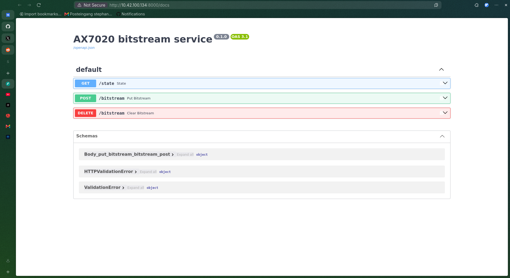

# Stage 5 von Hand: Bitstream per REST auf die PL

Protokoll vom 14.09.2026. Ziel des Tages: einmal die komplette Kette aus dem
Konzept-Artikel durchspielen, ohne dass irgendetwas davon schon dauerhaft
eingebaut ist. Alles, was hier passiert, lebt im RAM des Boards und ist nach
dem nächsten Neustart weg. Das ist Absicht: erst ausprobieren, dann ins Image
gießen.

Ergebnis vorweg:

```bash
F=/data/maxclerkwell/Repositories/alinx/bitstream/blinky/blinky.bit
curl -F file=@$F "http://10.42.100.134:8000/bitstream?sha256=$(sha256sum $F | cut -d' ' -f1)"
{"state":"operating","sha256":"f69a32d2…","bytes":4045524,"idcode":"0x03727093","filename":"blinky.bit"}
```

Die LEDs blinken. Verilog, offene Toolchain, HTTP, FPGA-Manager, fertig.

---

## 1. Ausgangslage nach dem Neustart

Das Board wurde stromlos gemacht. Es bootet dann immer den Stand aus dem
Flash: das Wartungssystem vom 31.08. mit dem alten Updater und ohne
Init-Skript. Es bleibt einfach stehen und ist per SSH erreichbar.

Woran man das erkennt, per JTAG ohne SSH:

```
BOOT_MODE 0x1                                 QSPI
Kernel command line: console=ttyPS0,115200 ip=dhcp     kein netconsole=, also kein kexec
pc -> cpu_v7_do_idle                          Linux läuft, wartet
DEVCFG_INT_STS: PCFG_DONE nicht gesetzt       PL leer
```

Oder per SSH:

```bash
ssh-keygen -R 10.42.100.134           # Hostkey wechselt bei jedem Boot
ssh root@10.42.100.134 'cat /proc/cmdline; ls /etc/rc5.d | grep ax7020'
```

Kommandozeile ohne `netconsole=` und keine `S99ax7020-update`: Flash-Stand.

## 2. Manuell in das neue Image springen

Der Flash-Stand kann kein Manifest lesen. Der neue Updater muss deshalb von
Hand aufs Board, dann holt er das aktuelle Image vom HTTP-Server und startet
es per kexec. Auf dem Host liegt alles in `build/images/`, Server ist
`python3 -m http.server 8080 --bind 10.42.100.20`.

Auf dem Board:

```sh
curl -fsSL -o /usr/bin/ax7020-update http://10.42.100.20:8080/ax7020-update && chmod 755 /usr/bin/ax7020-update
echo 'IMAGE_URL="http://10.42.100.20:8080/latest.manifest"' > /etc/ax7020-update.conf
ax7020-update
```

Sechs Sekunden später läuft das Image vom 10.09., die SSH-Verbindung bricht
dabei ab. Danach `ssh-keygen -R`, neu einloggen, `ls /etc/rc5.d | grep ax7020`
zeigt `S99ax7020-update`.

Das ist inhaltlich immer noch das Wartungssystem, nur die neuere Fassung mit
funktionierendem Updater. Ein echtes "großes" Image mit der API gibt es noch
nicht.

## 3. Blinky per SSH laden

```sh
mkdir -p /lib/firmware
curl -fsSL -o /lib/firmware/blinky.bin http://10.42.100.20:8080/blinky.bin
echo blinky.bin > /sys/class/fpga_manager/fpga0/firmware
cat /sys/class/fpga_manager/fpga0/state        # operating
```

Der FPGA-Manager sucht nur unter `/lib/firmware`. Neu laden heißt denselben
Befehl noch einmal, die PL wird dabei gelöscht und neu beschrieben. Ein
Entladen kennt der Manager nicht.

## 4. Python auf ein Image ohne Python

Das Wartungssystem hat kein Python, keinen Compiler, keine DNS-Konfiguration
und eine Uhr von 2018. Der Reihe nach:

```sh
printf 'nameserver 1.1.1.1\nnameserver 8.8.8.8\n' > /etc/resolv.conf   # ip=dhcp schreibt keine
ntpd -n -q -p pool.ntp.org                                             # sonst scheitert jedes TLS-Zertifikat

curl -fsSL https://github.com/astral-sh/uv/releases/latest/download/uv-armv7-unknown-linux-musleabihf.tar.gz | tar xz
install -m 755 uv-armv7-unknown-linux-musleabihf/uv /usr/bin/uv        # /usr/local/bin gibt es nicht
uv python install 3.12
```

Python startet dann nicht: `libgcc_s.so.1` fehlt im Minimal-Image. Die
Bibliothek liegt im Yocto-Build unter
`yocto/build/tmp/work/cortexa9t2hf-neon-poky-linux-gnueabi/libgcc/13.4.0/image/lib/`,
über den HTTP-Server nach `/lib/` auf dem Board kopiert.

Zwei Sackgassen:

* `uv run` ohne `--python 3.12` lädt sich still Python 3.14 herunter.
* `uvicorn[standard]` will `httptools` kompilieren. Es gibt keinen Compiler.
  Plain `uvicorn` ist reines Python.

Platzbedarf im RAM-Rootfs: uv 20 MB, Python 110 MB, Pakete wenige MB. Von
491 MB waren danach 357 MB frei. In die 32 MiB Flash passt davon nichts, was
den Architekturwechsel aus Stage 3 im Nachhinein bestätigt.

## 5. Die API

`api/app.py`, gestartet auf dem Board mit

```sh
cd /opt/ax7020-api
uv run --python 3.12 --with fastapi --with uvicorn --with python-multipart \
    uvicorn app:app --host 0.0.0.0 --port 8000
```

| Methode | Pfad | Tut |
|---|---|---|
| `GET` | `/state` | Zustand des FPGA-Managers, zuletzt geladener Name |
| `POST` | `/bitstream` | multipart `file=`, `.bit` oder `.bin`, optional `?sha256=`; prüft Sync-Word und IDCODE, konvertiert `.bit`, lädt, antwortet wenn die PL steht |
| `DELETE` | `/bitstream` | lädt `empty.bin`, ein Design nur mit PS7-Block, und löscht so die PL |

Die IDCODE-Prüfung sucht im Header das Kommando `0x30018001` (Typ-1-Paket,
Schreiben, Register IDCODE) und vergleicht das folgende Wort maskiert mit
`0x23727093`. Im Bitstream steht `0x03727093`, die oberen vier Bits sind die
Revision, deshalb die Maske.

Getestet, alle sechs Fälle:

| Aufruf | Antwort |
|---|---|
| POST `blinky.bit` mit `?sha256=` | `operating`, IDCODE `0x03727093` |
| GET `/state` | `operating`, `loaded: blinky.bit` |
| DELETE | `operating`, `loaded: empty`, LEDs aus |
| POST `blinky.bin` | `operating` |
| POST `README.md` | `{"error":"no sync word found - not a bitstream"}` |
| POST mit falscher Prüfsumme | `{"error":"sha256 mismatch: …"}` |

FastAPI liefert die Doku unter `/docs` selbst:



Der Lösch-Bitstream kommt aus `bitstream/empty/`, gebaut mit derselben Flow
wie der Blinky. Ohne die PS7-Instanz würde auch er die Kerne abschießen,
siehe Stage 4.

## 6. Was das noch nicht ist

* **Nichts davon überlebt einen Neustart.** Flash hat den Stand vom 31.08.,
  der Sprung ins neue Image war manuell, uv und Python liegen im RAM.
* **Keine Authentifizierung.** Wer den Port erreicht, lädt Bitstreams. Ein
  Bitstream mit AXI-Master schreibt in den gesamten RAM.
* **Kein Rezept.** Die API gehört in ein Yocto-Image mit Python, FastAPI und
  Init-Skript, publiziert als `latest.manifest`, damit der Updater sie beim
  Boot holt.
* **`IMAGE_URL` ist im Image leer.** Auch das neue Wartungssystem holt nichts,
  bis die URL im Rezept steht.

Reihenfolge, um daraus Betrieb zu machen: API-Image bauen, `IMAGE_URL` ins
Rezept, neues Wartungs-FIT flashen (`tools/flash-fit.sh`, braucht einmal die
Freigabe), Neustart, zusehen.

## Merksätze

* **Ausprobieren im RAM, einbauen im Image.** Jeder Schritt heute war
  rückgängig durch Stromlosmachen. Das macht Fehler billig.
* **Ein Minimal-Image ist wirklich minimal.** Kein DNS, keine Uhr, kein
  libgcc, kein Compiler. Jedes davon kostet eine Runde, keins ist schlimm.
* **"Löschen" ist auch nur Laden.** Der FPGA-Manager kennt kein Entladen, ein
  leeres Design mit PS7 ist der Ersatz.
* **Drei Stände desselben Systems sind zu viele.** Flash, Server, RAM sahen
  gleich aus. Ein Build-Stempel im Image kommt ins nächste Rezept.


---

## Nachtrag 15.09.: Betrieb

Alles aus Abschnitt 6 ist inzwischen eingebaut, siehe Stage 2 und Stage 5 in
der README: Image-Server auf dem Router, `ax7020-update.service` im
Wartungssystem, `ax7020-api-image` mit systemd und `ax7020-api.service`.
Auf dem Weg dorthin drei Dinge, die nur am Gerät sichtbar wurden:

* Roots Home ist unter systemd `/root`, das Schlüssel-Rezept installierte nach
  `/home/root` und sperrte aus. Gotcha 14.
* Ein Power-Cycle mit angestecktem JTAG-Adapter ist keiner: der FT232H hält die
  3,3-V-Schiene über TMS am Leben, der Flash behält seinen Zustand. Gotcha 16.
* Das systemd-Wartungsimage ist 21 MB, `bootcmd` las 16 MiB. U-Boot blieb mit
  `Bad FIT kernel image format` am Prompt stehen. Gotcha 17, behoben mit 24 MiB
  und einem per JTAG heiß geladenen U-Boot, das dann sein eigenes Image aus
  Linux heraus in die Partition geschrieben hat.
